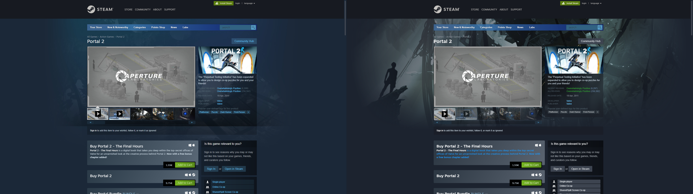
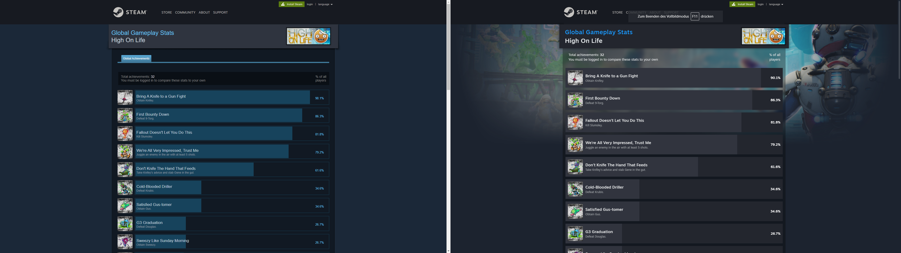

# Enhanced Steam (WIP)

A browser extension that modernizes the Steam UI based on Valve's latest design changes.
This is a work in progress, not much is implemented yet, many things are planned.
Most of the code (including css) right now is just a concept and not yet ready for publishing as downloadable extension.

### Current features are:
- Redesigned age verification page
- Redesigned game page
- Redesigned achievement and game lists
- Redesigned cart page
- Redesigned support page
- New "on wishlist" and "in library" banners
- Various other enhancements and fixes across multiple pages

### Screenshots (before/after):
> **Note**
> Any games or profiles shown in screenshots or example links are purely examples and not intended to promote.

> Enhanced Steam is not associated or affiliated with Steam or Valve Corporation. Steam is a trademark and/or registered trademark of Valve Corporation.
